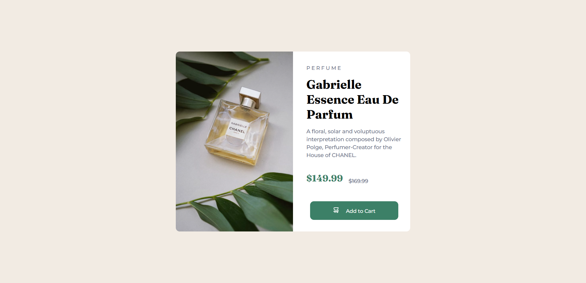

# Frontend Mentor - Product preview card component solution

This is a solution to the [Product preview card component challenge on Frontend Mentor](https://www.frontendmentor.io/challenges/product-preview-card-component-GO7UmttRfa). Frontend Mentor challenges help you improve your coding skills by building realistic projects. 

## Table of contents

- [Overview](#overview)
  - [The challenge](#the-challenge)
  - [Screenshot](#screenshot)
  - [Links](#links)
- [My process](#my-process)
  - [Built with](#built-with)
  - [What I learned](#what-i-learned)
  - [Continued development](#continued-development)
- [Author](#author)

## Overview

### The challenge

Users should be able to:

- View the optimal layout depending on their device's screen size
- See hover and focus states for interactive elements

### Screenshot

Screenshot of my final result:




### Links

- Live Site URL: [Live Site](https://arikiller.github.io/product-preview-card-component-main/)

## My process

Found difficult at first at how to properly do the HTML and how to get the styling correctly and have the image and the text side to side. Used CSS variables for the colours.

I tried to do an optimal layout for it to be able to be correctly visible on other devices screens but it doesnt quite work yet. Im doing a course on how to do this so I will come again to fix it.

### Built with

- Semantic HTML5 markup
- CSS custom properties

### What I learned

New types of styling, and put into practise some layout so in a phone screen it can be visible, but Im still learning so its not quite right yet.

My HTML so far:

```html
<div class="perfume">
      
      <div class="content">
        <small>P E R F U M E</small>
        <h1>Gabrielle Essence Eau De Parfum</h1>
        <p>
          A floral, solar and voluptuous interpretation composed by Olivier Polge,
          Perfumer-Creator for the House of CHANEL.
        </p>
        <div class="price">
          <h2>$149.99</h2>
          <p class="discount">$169.99</p>
        </div>
        <div class="cart">
          <button class="add-to-cart">
            
            <span>Add to Cart</span>
          </button>
        </div>
      </div>
    </div>
```

Some css I like:

```css
.cart button{
    background-color: var(--green500);
    color: var(--white);
    border: none;
    padding: 15px 60px;
    border-radius: 10px;
    font-family: 'Montserrat', sans-serif;
    font-weight: 500;
    cursor: pointer;
    transition: background-color 0.3s ease;
}

.cart button:hover{
    background-color: var(--green700);
}

body{
    background-color: var(--cream);
    display: flex;
    justify-content: center;
    align-items: center;
    min-height: 100vh;
    margin: 0;
}

```


### Continued development

I still need to learn more CSS, specially on how to make the style proper for every device screen.

## Author

- GitHub - [@AriKILLER](https://github.com/AriKILLER)
- Frontend Mentor - [@AriKILLER](https://www.frontendmentor.io/profile/AriKILLER)
- Discord - [@ari_killer]

